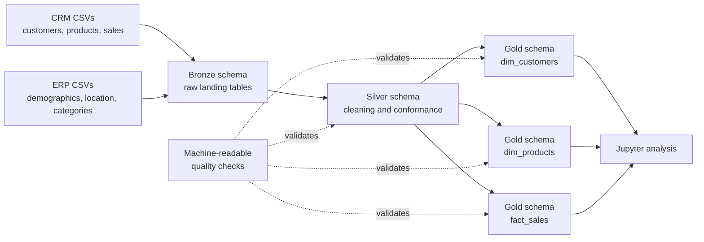
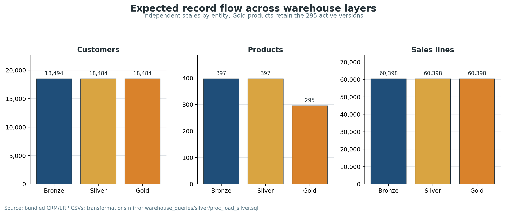
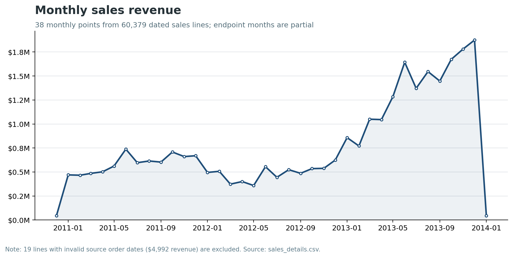

# Modern Data Warehouse with Medallion Architecture

A reproducible educational data-warehouse implementation that consolidates six CRM and ERP CSV extracts into a SQL Server star schema. The project demonstrates full-refresh ingestion, data standardization, source-system reconciliation, dimensional modelling, quality controls, and notebook-based analysis.

> **Scope:** This is a local, snapshot-oriented reference implementation. It uses relational SQL Server schemas named Bronze, Silver, and Gold; it is not a distributed lakehouse or a production cloud platform.

## Architecture



| Layer | Purpose | Physical implementation | Load strategy |
|---|---|---|---|
| Bronze | Preserve source extracts at their original grain | Six SQL Server tables | Truncate and bulk reload |
| Silver | Deduplicate, standardize, repair, and reconcile | Six SQL Server tables | Truncate and transform from Bronze |
| Gold | Publish a business-facing star schema | Two dimension views and one fact view | Virtual views over Silver |

## Project objectives

- Consolidate CRM and ERP extracts into a consistent analytical model.
- Preserve source traceability while applying explicit cleaning rules.
- Resolve cross-system key and domain inconsistencies.
- Enforce customer, product, sales, and referential-integrity checks.
- Expose reproducible Gold-layer KPIs and exploratory analysis.
- Demonstrate where an educational full-refresh design differs from a production warehouse.

## Data sources and provenance

The six bundled files are educational extracts from the [Data With Baraa SQL Data Warehouse Project](https://github.com/DataWithBaraa/sql-data-warehouse-project). Their SHA-256 hashes match the upstream files exactly; see [`ATTRIBUTION.md`](ATTRIBUTION.md).

| Source file | Intended grain | Rows | Notable raw conditions |
|---|---|---:|---|
| `source_crm/cust_info.csv` | Customer-master version | 18,494 | 4 null IDs and 6 duplicate-ID excess rows |
| `source_crm/prd_info.csv` | Product version | 397 | 2 missing costs and 17 missing product-line codes |
| `source_crm/sales_details.csv` | Sales order line | 60,398 | Missing/invalid amounts, prices, and 19 order dates |
| `source_erp/CUST_AZ12.csv` | Customer demographics | 18,484 | Missing gender values and prefixed customer IDs |
| `source_erp/LOC_A101.csv` | Customer location | 18,484 | 332 missing country values and punctuated IDs |
| `source_erp/PX_CAT_G1V2.csv` | Product-category lookup | 37 | CRM/ERP pedal-category key mismatch |

These files represent teaching data, not current operational CRM, ERP, customer, or financial records.

## Methodology

### Bronze: raw ingestion

[`warehouse_queries/bronze/ddl_bronze.sql`](warehouse_queries/bronze/ddl_bronze.sql) creates source-aligned landing tables. [`warehouse_queries/bronze/load_bronze.sql`](warehouse_queries/bronze/load_bronze.sql) truncates each table and bulk-loads the mounted CSV under `/project/datasets/`.

This design is repeatable for a static snapshot, but it does not preserve ingestion history or support incremental loads.

### Silver: cleaning and conformance

[`warehouse_queries/silver/proc_load_silver.sql`](warehouse_queries/silver/proc_load_silver.sql) applies the following rules:

| Entity | Transformation |
|---|---|
| Customers | Remove null IDs; retain the newest row per `cst_id`; trim names; standardize marital status and gender |
| Products | Split compound product keys; replace null cost with zero; standardize product line; derive effective end dates with `LEAD` |
| Sales | Parse integer dates; repair non-positive, missing, or inconsistent sales and price values |
| ERP demographics | Remove `NAS` key prefixes; reject future birthdates; standardize gender |
| ERP locations | Remove key hyphens; normalize Germany and United States codes; replace missing country with `n/a` |
| ERP categories | Trim lookup fields and standardize the CRM `CO_PE` key to ERP `CO_PD` for Components / Pedals |

Before harmonization, only 288 of 295 active products match the ERP category lookup. The explicit `CO_PE` → `CO_PD` rule raises expected active-product coverage to 295 of 295.

### Gold: star schema

[`warehouse_queries/gold/ddl_gold.sql`](warehouse_queries/gold/ddl_gold.sql) creates three analytical views:

| Gold view | Grain | Key fields | Rows expected from this snapshot |
|---|---|---|---:|
| `gold.dim_customers` | One row per customer | `customer_key`, `customer_id`, `customer_number` | 18,484 |
| `gold.dim_products` | One row per active product | `product_key`, `product_id`, `product_number` | 295 |
| `gold.fact_sales` | One row per sales line | `order_number`, `customer_key`, `product_key` | 60,398 |

CRM is used as the primary customer source. ERP contributes birthdate and location, while ERP gender is used when CRM gender is unavailable.



## Data-quality framework

The quality procedures now return one structured result set with `check_name`, `severity`, and `failed_rows`, allowing the notebook or CI to distinguish errors from documented warnings.

- [`warehouse_queries/Inspect/test_silver.sql`](warehouse_queries/Inspect/test_silver.sql) checks keys, domains, category coverage, costs, dates, measure arithmetic, and ERP completeness.
- [`warehouse_queries/Inspect/test_gold.sql`](warehouse_queries/Inspect/test_gold.sql) checks surrogate and natural keys, dimension enrichment, fact foreign keys, orphan records, dates, and measures.

### Validated source and transformation findings

| Finding | Evidence | Interpretation |
|---|---:|---|
| Customer deduplication | 18,494 raw → 18,484 conformed | 4 null-ID rows removed and duplicate customer versions resolved |
| Product lifecycle filter | 397 Silver versions → 295 active Gold products | Gold publishes the latest active product version only |
| Customer foreign-key coverage | 60,398 / 60,398 sales lines | All sales lines map to a conformed customer |
| Product foreign-key coverage | 60,398 / 60,398 sales lines | All sales lines map to an active product |
| Sales-amount repairs | 23 rows | Invalid or inconsistent amounts are recalculated from quantity × absolute price |
| Price repairs | 12 rows | Missing or non-positive prices are derived from sales ÷ quantity |
| Missing order dates | 19 rows, $4,992 revenue | Retained in the fact view but excluded from time-series analysis |
| Category coverage after harmonization | 295 / 295 active products | The explicit pedal-key rule resolves the source-system mismatch |

The exact source-derived values are stored in [`analysis_outputs/validated_metrics.csv`](analysis_outputs/validated_metrics.csv) and regenerated by [`scripts/generate_readme_assets.py`](scripts/generate_readme_assets.py).

## Analytical results

The following metrics are independently reproduced from the committed CSVs using the same transformations as the SQL pipeline:

| Metric | Result |
|---|---:|
| Total revenue | $29,356,250 |
| Distinct orders | 27,659 |
| Customers represented in sales | 18,484 |
| Average order value | $1,061.36 |
| Average revenue per customer | $1,588.20 |
| Order-date range | 29 December 2010 – 28 January 2014 |

### Revenue composition

| Product category | Revenue | Share |
|---|---:|---:|
| Bikes | $28,316,272 | 96.46% |
| Accessories | $700,262 | 2.39% |
| Clothing | $339,716 | 1.16% |

| Product line | Revenue | Share |
|---|---:|---:|
| Road | $14,622,850 | 49.81% |
| Mountain | $10,250,982 | 34.92% |
| Touring | $3,879,135 | 13.21% |
| Other Sales | $603,283 | 2.06% |

The dataset is highly concentrated in Bikes and in Road/Mountain product lines. These are descriptive properties of the teaching snapshot and should not be generalized to a real company.

### Monthly sales



The trend contains 38 monthly observations. December 2010 and January 2014 are partial months, so their totals are not directly comparable with complete periods. Nineteen lines with invalid source order dates are excluded from the chart.

## Reproduction

### Prerequisites

- Docker Desktop or another Docker-compatible engine
- Python 3.10 or newer
- Microsoft ODBC Driver 18 for SQL Server
- A SQL client or JupyterLab

The container uses Microsoft's current SQL Server 2022 Linux image. Consult the [official SQL Server container quickstart](https://learn.microsoft.com/en-us/sql/linux/install-upgrade/quickstart-install-docker) for platform-specific requirements.

### 1. Configure the environment

```bash
cp .env.example .env
```

Replace the example password in `.env` with a strong local development password. Then export the same variables for Jupyter:

```bash
set -a
source .env
set +a
```

The real `.env` file is ignored by Git.

### 2. Start SQL Server

```bash
docker compose up -d
docker compose ps
```

The repository is mounted read-only at `/project`, matching the paths used by the Bronze loader. The named `sqlserver_data` volume preserves the SQL Server data directory between container restarts.

If the Docker Compose plugin is unavailable, use the equivalent command:

```bash
docker volume create medallion_sqlserver_data
docker run --platform linux/amd64 \
  --name medallion-sqlserver \
  --env-file .env \
  -e ACCEPT_EULA=Y \
  -e MSSQL_PID=Developer \
  -p 1433:1433 \
  -v "$PWD":/project:ro \
  -v medallion_sqlserver_data:/var/opt/mssql \
  -d mcr.microsoft.com/mssql/server:2022-latest
```

> `compose.yaml` requests `linux/amd64`. Apple Silicon hosts may therefore use emulation and run more slowly.

### 3. Create the Python environment

```bash
python -m venv .venv
source .venv/bin/activate
python -m pip install --upgrade pip
python -m pip install -r requirements.txt
```

### 4. Run the tutorial notebook

```bash
jupyter lab analysis.ipynb
```

Run every cell from the repository root. The notebook:

1. drops and recreates `data_warehouse_prj`;
2. defines the schemas, tables, loaders, Gold views, and quality procedures;
3. executes the Bronze and Silver full-refresh loads;
4. fails immediately on SQL errors;
5. reports Silver and Gold quality results; and
6. calculates Gold KPIs and charts.

> **Destructive operation:** the architecture cell drops the entire development database. Do not run it against an environment containing data that must be retained.

### 5. Regenerate README evidence

```bash
python scripts/generate_readme_assets.py
```

This command validates the committed source data, rewrites `analysis_outputs/validated_metrics.csv`, and regenerates both README figures.

## Manual SQL execution order

If the notebook is not used, execute the scripts and procedures in this order:

1. `warehouse_queries/architecture.sql`
2. `warehouse_queries/bronze/ddl_bronze.sql`
3. `warehouse_queries/silver/ddl_silver.sql`
4. `warehouse_queries/bronze/load_bronze.sql`
5. `warehouse_queries/silver/proc_load_silver.sql`
6. `warehouse_queries/gold/ddl_gold.sql`
7. `warehouse_queries/Inspect/test_silver.sql`
8. `warehouse_queries/Inspect/test_gold.sql`
9. `EXEC sp_create_bronze_tables;`
10. `EXEC sp_create_silver_tables;`
11. `EXEC bronze.load_bronze;`
12. `EXEC silver.load_silver;`
13. `EXEC sp_create_gold_views;`
14. `EXEC sp_test_silver;`
15. `EXEC sp_test_gold;`

## Repository structure

```text
├── datasets/
│   ├── source_crm/                 # Customer, product, and sales extracts
│   └── source_erp/                 # Demographics, location, and category extracts
├── warehouse_queries/
│   ├── bronze/                     # Landing-table DDL and bulk loader
│   ├── silver/                     # Conformed-table DDL and transformation procedure
│   ├── gold/                       # Star-schema view definitions
│   ├── Inspect/                    # Silver and Gold quality procedures
│   └── architecture.sql            # Destructive development database setup
├── analysis.ipynb                  # Secure, fail-fast build and analysis tutorial
├── scripts/generate_readme_assets.py
├── analysis_outputs/               # Validated source-derived metrics
├── assets/                         # README figures
├── compose.yaml                    # SQL Server 2022 development service
├── .env.example                    # Non-secret connection template
├── requirements.txt                # Notebook and figure dependencies
├── ATTRIBUTION.md                  # Upstream source and dataset hashes
└── LICENSE                         # MIT notices for upstream and adaptations
```

## Reproducibility status

| Check | Status |
|---|---|
| Dataset hashes versus attributed upstream | Verified |
| Source profile and transformation assertions | Passed |
| README figure inspection | Passed |
| Notebook JSON and Python syntax | Passed |
| SQL Server engine execution in automated CI | Not configured; run the notebook locally |

## Limitations and production gaps

- Full-refresh truncation is appropriate only for this static educational snapshot.
- Gold objects are views; `ROW_NUMBER()` keys are not durable warehouse surrogate keys.
- There is no date dimension, slowly changing dimension strategy, lineage store, or run-audit table.
- The loaders do not implement incremental ingestion, late-arriving data handling, or reject quarantine.
- Quality procedures run on demand and are not yet enforced in CI.
- Credentials use the `sa` development account; production deployments should use least-privilege identities and a secret manager.
- Monthly trends exclude the 19 invalid order-date rows and include two partial endpoint months.
- Docker networking, storage, backup, recovery, monitoring, and resource limits require production-specific design.

## Recommended extensions

1. Persist dimension surrogate keys and define a Type 1 or Type 2 historization policy.
2. Add a date dimension, fiscal calendar, and explicit unknown-member records.
3. Introduce incremental loads with watermarking and run-level audit metadata.
4. Quarantine rejected source rows rather than converting every issue in place.
5. Execute the quality procedures in CI against an ephemeral SQL Server container.
6. Add orchestration with Airflow, Dagster, or Azure Data Factory and publish the Gold model to a BI layer.

## Author

**Goutham SDS Kodali**

- [LinkedIn](https://www.linkedin.com/in/sds-kodali/)
- [GitHub](https://github.com/goutham-1902)

## License and attribution

The repository is distributed under the [MIT License](LICENSE). It preserves the upstream copyright notice for Baraa Khatib Salkini and identifies Goutham SDS Kodali's adaptations separately. See [`ATTRIBUTION.md`](ATTRIBUTION.md) for source provenance and exact dataset hashes.
